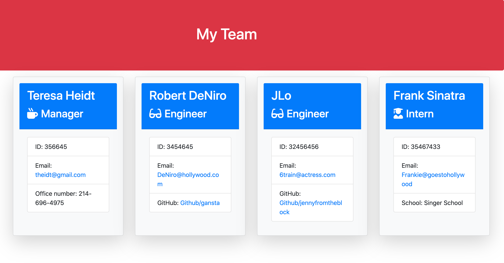

# Team-Profile-Generator
## Contents:
* User story
* What this application is
* How the application works
* Installation 
* Tests
* Technologies used
* Images
* Link
## User Story:
User would like to generate a webpage that displays the team's basic information so that they have QUICK access to emails and Github profiles. 
## What this application is:
This is a functional application created using Node CLI, that takes in information about employees and generates an HTML webpage that displays summaries for each person. 
## How the application works:
When the user typs in node app.js in the terminal, a series of questions prompts one after the other, asking for the following:
- Name
- employee Id
- Email Address 
- Github account (if the name of the employee is MANAGER or ENGINEER)
    *OTHERWISE*
- School they attended
Any number of interns, managers and/or engineers can be iput in to the command line.
When the HTML main page is opened in the browser, the questions and answers are displayed.
## Installation:
npm install Inquirer.
## Technologies used:
Bootstrap was used for styling. 
This is a Node application.
## Tests:
Tests were run on Employee, Engineer, Intern and Manager. All unit tests have been passed.
## Images:
This is the basic design for the application.

## Link:
Teresa Heidt's portfolio: 

[Portfolio](https://teresaheidt.github.io/TH-Portfolio/)

Link to Github repository:

[Github](https://github.com/teresaheidt/Team-Profile-Generator)
